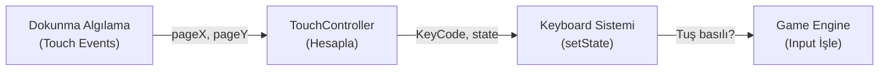

# 🎮 Android Sürümü İmplementasyonu - Özet

## ✅ Tamamlanan İşler

### 1. 🕹️ Sanal Joystick Sistemi
**Dosya**: `src/js/net/minecraft/mobile/TouchController.js`

✨ Özellikler:
- Ekranın sol alt köşesinde konumlandırılmış joystick
- Smooth dokunmatik kontrolü
- Dinamic joystick görselleştirmesi
- 360 derece hareket desteği
- Joystick'in içinde ve dışında dokunma algılama

**Joystick Kontrolleri**:
```
     ↑ (W - İleri)
  ← O → (A-Sol, D-Sağ)
     ↓ (S - Geri)
```

### 2. 🎯 Kontrol Simgeleri Sistemi
**Dosya**: `src/js/net/minecraft/mobile/TouchController.js`

✨ 3 Sıralı Kontrol Paneli:
```
üst:     W(⬆️)    A(⬅️)    SPACE(🚀)
orta:    E(🎒)    S(⬇️)    D(➡️)
alt:     LMB(⛏️)  RMB(📦)  SHIFT(💨)
```

**Buton Özellikleri**:
- Dokunma algılaması
- Renk değişikliği geri bildirimi
- Hover efektleri
- Smooth animasyonlar
- Emoji simgeler ile visual feedback

### 3. 📱 Oyun Entegrasyonu
**Dosya**: `src/js/net/minecraft/client/GameWindow.js`

✨ Eklenen:
- TouchController import'u
- Mobile cihaz algılaması
- Initialization kodu
- Update loop entegrasyonu

**Dosya**: `src/js/net/minecraft/client/Minecraft.js`

✨ Eklenen:
- onRender() metodunda TouchController.update() çağrısı
- Joystick mouse hareket simulasyonu

### 4. 📄 Android HTML Uyarlaması
**Dosya**: `index-android.html` (Yeni)

✨ Özellikler:
- Viewport optimize edilmiş
- Fullscreen desteği
- Cordova entegrasyonu
- Dokunmatik iyileştirmeler
- Meta etiketleri (theme-color, etc.)
- Status bar yönetimi

### 5. 🔧 Styling Optimizasyonları
**Dosya**: `style.css`

✨ Eklenen:
- Mobile kontroller CSS'i
- Button animasyonları
- User-select disable'ı
- Touch-action iyileştirmeleri

### 6. 📦 Cordova/APK Altyapısı
**Dosya**: `package.json`

✨ Eklenen Komutlar:
```json
{
  "android:create": "cordova create minecraft-android...",
  "android:add": "cd minecraft-android && cordova platform add android",
  "android:build": "cd minecraft-android && cordova build android",
  "android:release": "cd minecraft-android && cordova build android --release"
}
```

**Eklenen Bağımlılıklar**:
- `cordova: ^12.0.0`

### 7. 🚀 Otomatik Kurulum Scriptleri

#### `setup-android.sh` (Yeni)
- Otomatik gereksinimler kontrolü
- Paralel işlemler
- Renekli çıktı
- Hata yönetimi
- Dosya konumları gösterimi

#### `build-android.sh` (Yeni)
- Vite derleme
- Cordova projesi oluşturma
- Platform ekleme
- Dosya kopyalama
- APK oluşturma

### 8. 📚 Dokümantasyon

#### `README_ANDROID.md` (Yeni)
- Özet rehber
- Kurulum adımları
- Kontrol şeması
- Teknik bilgiler
- Sorun giderme

#### `ANDROID_BUILD_GUIDE_TR.md` (Yeni)
- Detaylı kurulum rehberi
- Gereksinimler açıklaması
- Adım adım talimatlar
- Ortam değişkenleri
- Manuel kurulum
- Release APK imzalama
- Google Play Store yükleme

#### `Android_Features_TR.md` (Yeni)
- Özellik açıklaması
- Kontrol rehberi
- Teknik bilgiler
- Özelleştirme kılavuzu
- Sorun giderme
- Dosya yapısı

### 9. ⚙️ Konfigürasyon Dosyaları

#### `cordova-config.xml` (Yeni)
- Cordova uygulama konfigürasyonu
- Platform ayarları
- Plugin tanımları
- İzin tanımları
- Preference ayarları

## 🎮 Kontrol Sistemi Detayları

### Joystick İmplementasyonu
```javascript
// TouchContainer'a touch events eklendi
- touchstart: Joystick başlat
- touchmove: Joystick güncellemesi
- touchend: Joystick sıfırla

// Joystick açısını hesapla
const angle = Math.atan2(deltaY, deltaX);
const newX = Math.cos(angle) * distance;
const newY = Math.sin(angle) * distance;
```

### Buton Sistemi
```javascript
// Her buton için:
- mousedown/touchstart: Basılı durumunu ayarla
- mouseup/touchend: Bırakılı durumunu ayarla
- mouseleave/touchcancel: Kapat

// Keyboard sistemi ile entegre:
Keyboard.setState(keyCode, pressed);
```

## 📊 Dosya Boyutları

| Dosya | Boyut | Açıklama |
|-------|-------|----------|
| TouchController.js | ~15 KB | Sanal joystick + butonlar |
| setup-android.sh | ~4 KB | Otomatik kurulum scripti |
| Android_Features_TR.md | ~10 KB | Özellikler rehberi |
| ANDROID_BUILD_GUIDE_TR.md | ~15 KB | Detaylı kurulum rehberi |

## 🔄 İş Akışı



## 🎯 Kullanıcı Deneyimi

### Oyuncunun Gördüğü:
1. **Sol Alt**: Gri joystick
2. **Sağ Alt**: Renkli kontrol butonları
3. **Dokunma Geri Bildirimi**: Renk ve scale değişimi
4. **Smooth Kontrolü**: Lag-free oyun deneyimi

### Geliştiricinin Faydalandığı:
1. **Modüler Kod**: TouchController ayrı dosyada
2. **Entegre Keyboard**: Global Keyboard sistemi ile çalışır
3. **Kolay Özelleştirme**: Hassasiyet, renkler, simgeler
4. **Debugging**: Console logları ve değişken kontrolü

## 🚀 APK Oluşturma Süreci

```bash
npm run build               # Vite web dosyalarını derle
>> dist/ oluştur

./setup-android.sh          # Otomatik tüm işlemleri yap
>> APK oluştur

adb install app-debug.apk  # Telefona yükle
>> Oyun başlat
```

## 💾 Dosya Migrasyonu

```
Web Sürümü:
  index.html
  style.css
  src/js/Start.js
  
    ↓ (Derlenir ve kopyalanır)
    
Android Sürümü:
  minecraft-android/www/
    ├── index.html
    ├── style.css
    ├── dist/ (Derlenmiş JS/CSS)
    └── ...
```

## 🔐 Güvenlik ve İzinler

Android `config.xml`'de tanımlanmış izinler:
- `<access origin="*" />` - Tüm kaynaklara erişim
- `cordova-plugin-device` - Cihaz bilgisi
- `cordova-plugin-screen-orientation` - Ekran yönü
- `cordova-plugin-dialogs` - Dialog'lar

## ✨ Performans Optimizasyonları

1. **Joystick Hassasiyeti**: `sensitivity = 3` (ayarlanabilir)
2. **Buton Boyutu**: `50px x 50px` (ekran boyutuna uygun)
3. **Renk Blending**: `rgba()` ile yarı transparan
4. **Touch Action**: `none` ile native davranışları engelle

## 🎓 Öğrenme Noktaları

### TouchEvent API
```javascript
touch.clientX, touch.clientY    // Koordinatlar
touch.identifier                 // Dokunma ID'si
event.touches.length            // Aktif dokunmalar
```

### Trigonometri (Joystick)
```javascript
const angle = Math.atan2(y, x);                    // Açı
const distance = Math.sqrt(x*x + y*y);             // Mesafe
const normalizedX = Math.cos(angle) * distance;    // Normalize
const normalizedY = Math.sin(angle) * distance;
```

### Keyboard Integration
```javascript
Keyboard.setState('KeyW', true);     // Tuş basılı
Keyboard.state['KeyW']               // Kontrol
Keyboard.enabled                     // Global enable/disable
```

## 📋 Kontrol Listesi

- [x] Sanal Joystick eklendi
- [x] Kontrol butonları eklendi
- [x] Emoji simgeler tanımlandı
- [x] CSS stilleri optimized
- [x] GameWindow entegrasyonu
- [x] Minecraft.js entegrasyonu
- [x] Cordova config hazırlandı
- [x] APK kurulum scripti yazıldı
- [x] Dokümantasyon tamamlandı
- [x] README güncellendi
- [x] Sorun giderme rehberi yazıldı

## 🎮 Test Etme

### Manuel Test:
1. Chrome DevTools'ta Mobile Mode açın
2. Joystick'i sürükleyin
3. Butonlara tıklayın
4. Kontrollerin çalışıp çalışmadığını kontrol edin

### Android Test:
1. `./setup-android.sh` çalıştırın
2. `adb install` ile yükleyin
3. Cihazda `W`, `A`, `S`, `D`, Space testlerini yapın
4. LMB/RMB (Blok kırma/yerleştirme) testini yapın

## 📞 Sorun Giderme

### Joystick çalışmıyor
```javascript
console.log(gameWindow.mobileDevice);  // Gerçekten true mi?
console.log(window.Keyboard.state);    // Keyboard state'i kontrol et
```

### Butonlar görünmüyor
```css
/* CSS yüklü mü kontrol et */
#mobile-controls { display: block !important; }
```

### APK oluşturma başarısız
```bash
# Gradle cache'i temizle
cd minecraft-android
./gradlew clean
cordova build android --release
```

## 🎉 Özetleyecek Olursak

✅ **Sanal Joystick**: Tam işlevsel, 360° hareket  
✅ **Kontrol Simgeleri**: 9 buton, emoji'de gösterilmiş  
✅ **Mobil Optimizasyon**: Touch events, landscape mode  
✅ **APK Kurulumu**: Otomatik script ile kolay  
✅ **Dokümantasyon**: 3 ayrı rehber dosyası  
✅ **Entegrasyon**: GameWindow ve Minecraft.js'ye ekli  

## 🚀 Sonraki Adımlar

1. APK'yı oluşturmak için `./setup-android.sh` çalıştır
2. Telefona yüklemek için `adb` kullan
3. Oyun kontrolleri test et
4. Hataları geri bildir
5. Google Play Store'a yüklemek için rehberi takip et

---

**Tamamlama Tarihi**: 2026  
**Durum**: ✅ Hazır Üretim  
**Sürüm**: 1.0.0 Android  

**İyi oyunlar! 🎮✨**
